# Building And Station Help

This document captures the current and planned upgrade progression for the player's station and surface structures. It is written to be reused later in the in-app help display.

## Use In Help UI

- Explain what each structure does.
- Show how structure tiers evolve visually.
- Describe that higher station tiers unlock storage, shipbuilding, and advanced construction.
- Reuse the icon asset links below anywhere the web help panel needs them.

## Core Rule

- Structures upgrade in place by tier.
- Higher tiers cost more, produce more, and use a more advanced icon.
- The station is the central unlock structure.
- Surface structures improve local production.

## Station Progression

| Tier | Icon | Name | Role | Unlock Focus |
| --- | --- | --- | --- | --- |
| I | 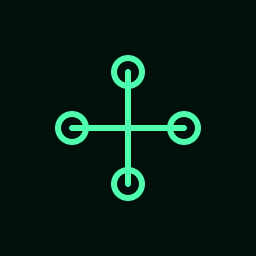 | Station I | Starting command and storage hub | Mine I, Hab I, Solar I |
| II | 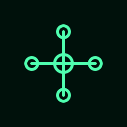 | Station II | Reinforced logistics hub | Level II surface upgrades |
| III | 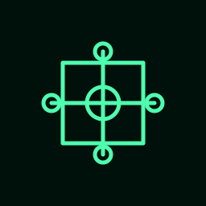 | Station III | Industrial shipyard node | Level III-IV structures |
| IV | 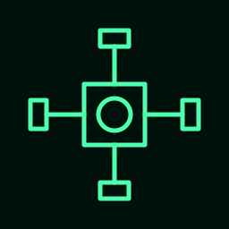 | Station IV | Orbital fabrication station | Level V structures |
| V | 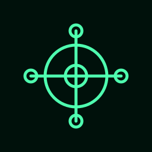 | Station V | Sector operations hub | Level VI structures |
| VI | 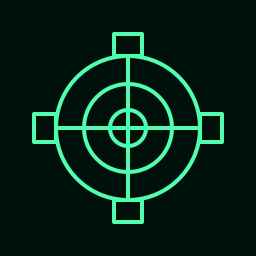 | Station VI | Fleet support yard | Level VII structures |
| VII | 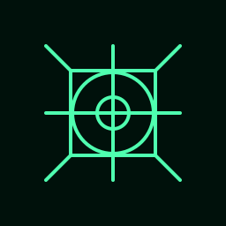 | Station VII | Fortress shipyard | Level VIII structures |
| VIII | 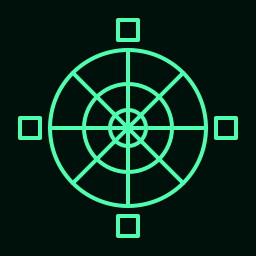 | Station VIII | Capital command nexus | Full late-game tree |

## Surface Structures

### Mine
- Produces: ore.
- Upgrade theme: extraction depth, heavier machinery, more industrial framing.

| Tier | Icon | Name | Gameplay Role | Visual Direction |
| --- | --- | --- | --- | --- |
| I | 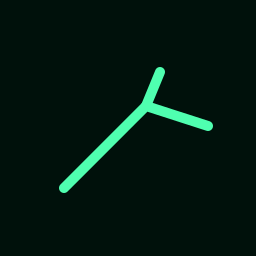 | Mine | Basic ore extraction | Pickaxe glyph |
| II | 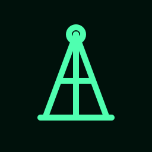 | Deep Mine | Better ore yield | Headframe tower |
| III | 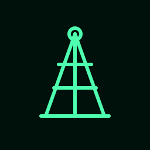 | Reinforced Mine | Stronger extraction | Twin-braced tower |
| IV | 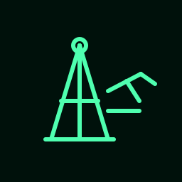 | Conveyor Mine | Adds ore transfer | Tower plus conveyor arm |
| V | 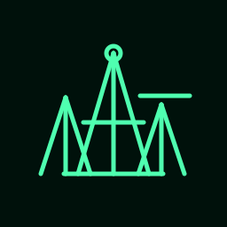 | Mine Complex | Multi-shaft output | Multiple tower silhouettes |
| VI | 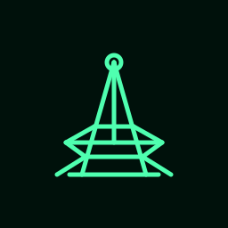 | Excavation Works | Broad industrial extraction | Tiered pit plus frame |
| VII | 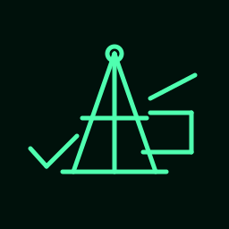 | Heavy Extractor | Large-scale ore pull | Heavy gantry and drill head |
| VIII | 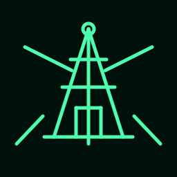 | Core Bore Mine | Maximum ore production | Massive core bore rig |

### Solar Array
- Produces: energy.
- Upgrade theme: more collection surfaces, stronger truss geometry, collector rings.

| Tier | Icon | Name | Gameplay Role | Visual Direction |
| --- | --- | --- | --- | --- |
| I | 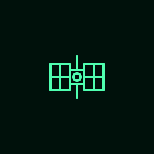 | Solar Array | Basic power generation | Two-wing panel array |
| II | 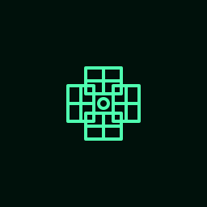 | Solar Array II | Better power generation | Four-wing panel array |
| III | 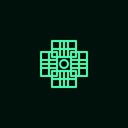 | Solar Grid | Larger collection area | Four-wing dense panel grid |
| IV | 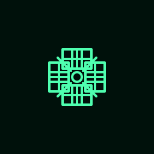 | Solar Lattice | Structural energy lattice | Array with brace arms |
| V | 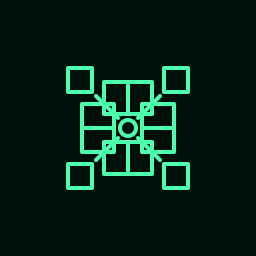 | Solar Bloom | High capture rate | Eight-panel starburst |
| VI | 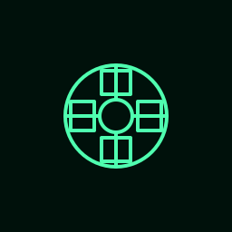 | Collector Ring | Ring-assisted collection | Hub plus collector ring |
| VII | 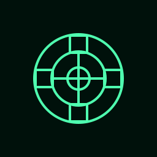 | Dual Collector Ring | Advanced energy harvest | Dual halo collector |
| VIII | 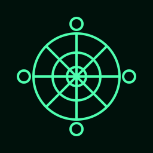 | Dyson Node | Maximum energy tier | Dense halo and collector pods |

### Hab
- Produces: food / population support.
- Upgrade theme: settlement growth from outpost to colony to arcology.

| Tier | Icon | Name | Gameplay Role | Visual Direction |
| --- | --- | --- | --- | --- |
| I | 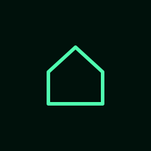 | Hab Outpost | Basic colony support | Small roofed outpost |
| II |  | Colony | Larger settlement support | Dome habitat |
| III |  | Colony Annex | Expanded population | Main dome plus annex |
| IV |  | Twin Colony | Connected habitat pair | Twin domes with corridor |
| V |  | Colony Cluster | Broader support footprint | Three-dome cluster |
| VI | 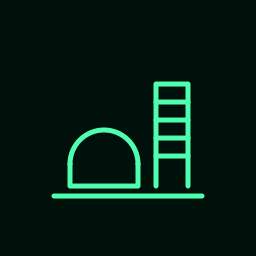 | Arcology Base | Vertical growth | Dome plus tower |
| VII |  | Biodome Complex | High support capacity | Large biodome campus |
| VIII | 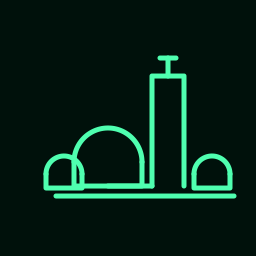 | Arcology Nexus | Maximum support tier | Multi-dome city with spire |

## Upgrade Pattern

- Tier I: establish the structure.
- Tier II: visibly upgrade the same role.
- Tier III-IV: add secondary structure and stronger silhouette.
- Tier V-VI: move from single building to complex.
- Tier VII-VIII: late-game megastructure look.

## Later Help Panel Content Draft

Suggested compact copy for in-app display:

- Station upgrades increase storage and unlock new build options.
- Mine upgrades increase ore production.
- Solar upgrades increase energy production.
- Hab upgrades increase food and colony support.
- Higher tiers use more advanced icons so players can read progression at a glance.

## Asset Notes

- Current generated icons live in [public/icons](/Users/doug.frazier/Documents/Github/Dots/DotsDevvitWeird/spacehunt/public/icons).
- Full icon sets now exist for Mine, Solar Array, Hab, and Station, tiers I-VIII.
- Space Dock icons exist for T1-T3.
- Ship type icons exist for all 13 player-buildable ship types.

## Space Dock

- Enables: ship construction.
- Upgrade theme: larger docking bays, more structural arms, inner ring.
- Higher tiers unlock progressively more powerful ship types.

| Tier | Icon | Name | Gameplay Role | Visual Direction |
| --- | --- | --- | --- | --- |
| T1 |  | Space Dock T1 | Basic ship construction | Box frame with side clamps |
| T2 |  | Space Dock T2 | Advanced ship construction | Larger frame, four docking arms, inner ring |
| T3 | 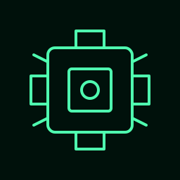 | Space Dock T3 | Capital ship construction | Double frame, diagonal struts, full ring |

## Ship Types

Ships are built at a Space Dock. Each type has unique speed, offense, defense, and transport stats. Dock tier and level prerequisites gate access to more powerful vessels.

### Dock T1 Lv1 — Starter Ships

| ID | Icon | Name | Speed | Off | Def | Transport | ShipPts | Notes |
| --- | --- | --- | --- | --- | --- | --- | --- | --- |
| 1 |  | Scout | 7 | 10 | 20 | 0 | 1 | Fast reconnaissance |
| 2 |  | Freighter | 3 | 0 | 30 | 500 | 2 | Cargo hauler |
| 11 |  | Basic Probe | 5 | 0 | 10 | 0 | 1 | Scouting / fog-of-war |

### Dock T1 Lv3 — Mid-Tier Ships

| ID | Icon | Name | Speed | Off | Def | Transport | ShipPts | Notes |
| --- | --- | --- | --- | --- | --- | --- | --- | --- |
| 3 | 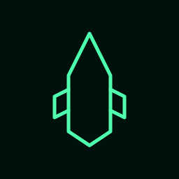 | Destroyer | 6 | 20 | 30 | 0 | 2 | Fast combat |
| 8 |  | Colony Ship | 3 | 0 | 30 | 0 | 10 | Colonizes new stars |
| 10 |  | Troop Transport | 3 | 10 | 30 | 0 | 4 | Ground assault |
| 12 |  | Enhanced Probe | 7 | 0 | 20 | 0 | 3 | Advanced scouting |
| 14 |  | Wrecker | 3 | 0 | 30 | 0 | 4 | Demolishes enemy buildings |
| 15 |  | Raider | 3 | 0 | 30 | 500 | 4 | Cargo on combat ship |

### Dock T2 — Heavy Ships

| ID | Icon | Name | Speed | Off | Def | Transport | ShipPts | Notes |
| --- | --- | --- | --- | --- | --- | --- | --- | --- |
| 4 |  | Frigate (T2 Lv1) | 5 | 30 | 40 | 0 | 4 | Balanced warship |
| 5 | 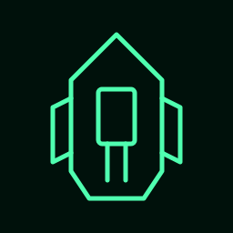 | Battleship (T2 Lv5) | 5 | 60 | 60 | 0 | 8 | Heavy firepower |

### Dock T3 — Capital Ships

| ID | Icon | Name | Speed | Off | Def | Transport | ShipPts | Notes |
| --- | --- | --- | --- | --- | --- | --- | --- | --- |
| 6 |  | Command Cruiser (T3 Lv3) | 5 | 60 | 80 | 5 | 6 | Can colonize |
| 7 |  | Dreadnought (T3 Lv3) | 5 | 80 | 80 | 0 | 10 | Ultimate warship |

### Weapon Effectiveness (10× Counter)

| Attacker | Defender |
| --- | --- |
| Scout (1) | Destroyer (3) |
| Destroyer (3) | Frigate (4) |
| Frigate (4) | Scout (1) |
| Battleship (5) | Command Cruiser (6) |
| Command Cruiser (6) | Battleship (5) |
| Dreadnought (7) | Battleship (5) |