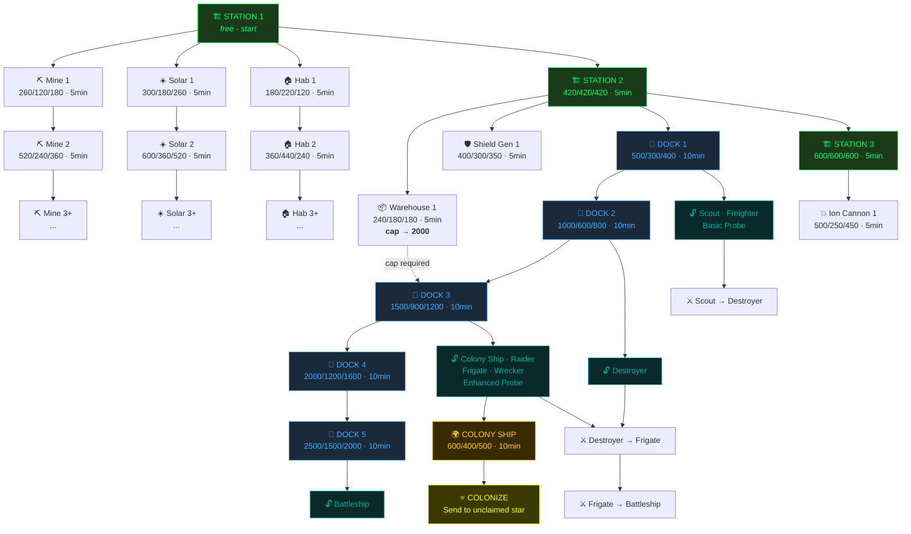

# Valcordia Space — Build Tree & Colonization Path

## Resource Economy

- **Rates are per minute** (continuous accumulation)
- **Base rate** (Station ≥ 1): 84 ore/min, 84 food/min, 84 energy/min
- **Bonus per producer level**: `21 × (level × (level+1) / 2)` added to base
- **Starting resources**: 640 ore, 640 food, 640 energy
- **Base cap**: 1600 (all resources share same cap)
- **Warehouse bonus**: +400 per warehouse level

| Producer Level | Bonus/min | Total Rate/min |
|:-:|:-:|:-:|
| 0 | 0 | 84 |
| 1 | +21 | 105 |
| 2 | +63 | 147 |
| 3 | +126 | 210 |
| 4 | +210 | 294 |
| 5 | +315 | 399 |

> Mine → ore, Hab → food, Solar → energy

---

## Buildings

### Catalog

| Building | Max Lv | Build Time | Prerequisite |
|----------|:------:|:----------:|:------------:|
| Station | 8 | 5 min | — |
| Mine | 8 | 5 min | Station 1 |
| Solar Array | 8 | 5 min | Station 1 |
| Hab | 8 | 5 min | Station 1 |
| Warehouse | 8 | 5 min | Station 2 |
| Space Dock | 5 | 10 min | Station 2 |
| Shield Gen | 5 | 5 min | Station 2 |
| Ion Cannon | 5 | 5 min | Station 3 |

### Cost Formulas

**Station**: `420 + 180 × max(0, level - 2)` each resource

| Level | Ore | Food | Energy |
|:-----:|:---:|:----:|:------:|
| 1 | 420 | 420 | 420 |
| 2 | 420 | 420 | 420 |
| 3 | 600 | 600 | 600 |

**All others**: `base × targetLevel`

| Building | Base Ore | Base Food | Base Energy |
|----------|:--------:|:---------:|:-----------:|
| Mine | 260 | 120 | 180 |
| Solar | 300 | 180 | 260 |
| Hab | 180 | 220 | 120 |
| Warehouse | 240 | 180 | 180 |
| Dock | 500 | 300 | 400 |
| Shield | 400 | 300 | 350 |
| Cannon | 500 | 250 | 450 |

Example: Dock 3 = 1500/900/1200

---

## Ships

### Dock Tier System

| Dock Building Level | Tier | Effective Level |
|:-------------------:|:----:|:---------------:|
| 1 | 1 | 1 |
| 2 | 1 | 2 |
| 3 | 2 | 1 |
| 4 | 2 | 2 |
| 5 | 3 | 1 |

A ship unlocks when `playerTier > requiredTier` OR `playerTier == requiredTier AND playerTierLevel >= requiredDockLevel`.

### Ship Catalog

| Ship | ID | Dock Req | Ore | Food | Energy | Build Time | Off | Def |
|------|----|:--------:|:---:|:----:|:------:|:----------:|:---:|:---:|
| Basic Probe | 11 | T1 L1 (Dock 1) | 60 | 30 | 50 | 30s | 0 | 10 |
| Scout | 1 | T1 L1 (Dock 1) | 100 | 50 | 80 | 1 min | 10 | 20 |
| Freighter | 2 | T1 L1 (Dock 1) | 200 | 100 | 150 | 2 min | 0 | 30 |
| Destroyer | 3 | T1 L2 (Dock 2) | 250 | 120 | 200 | 3 min | 20 | 30 |
| Enhanced Probe | 12 | T1 L3 (Dock 3†) | 180 | 80 | 150 | 2 min | 0 | 20 |
| **Colony Ship** | 8 | T1 L3 (Dock 3†) | 600 | 400 | 500 | 10 min | 0 | 30 |
| Troop Transport | 10 | T1 L3 (Dock 3†) | 350 | 250 | 300 | 5 min | 10 | 30 |
| Wrecker | 14 | T1 L3 (Dock 3†) | 400 | 200 | 300 | 5 min | 0 | 30 |
| Raider | 15 | T1 L3 (Dock 3†) | 380 | 220 | 320 | 5 min | 40 | 20 |
| Frigate | 4 | T2 L1 (Dock 3) | 400 | 200 | 350 | 5 min | 30 | 40 |
| Battleship | 5 | T2 L5 (Dock 5‡) | 800 | 400 | 700 | 10 min | 60 | 60 |
| Command Cruiser | 6 | T3 L3 (unobtainable) | 900 | 500 | 800 | 12 min | 60 | 80 |
| Dreadnought | 7 | T3 L3 (unobtainable) | 1200 | 600 | 1000 | 15 min | 80 | 80 |

> † T1 L3 required but Dock 3 = Tier 2. Since Tier 2 > Tier 1, these unlock at Dock 3.
> ‡ T2 L5 but max Tier 2 effective level is 2 (at Dock 4). Since Dock 5 = Tier 3 > Tier 2, Battleship unlocks at Dock 5.
> Command Cruiser & Dreadnought require T3 L3 but max Tier 3 effective level is 1 (Dock 5). Currently unobtainable.

---

## Dependency Tree



---

## Fastest Path to First Colonization

### Goal
Build a Colony Ship (ID 8) and send it to an unclaimed star.

### Requirements
- Dock building level ≥ 3 (unlocks Colony Ship)
- 600 ore + 400 food + 500 energy available to build Colony Ship
- 10 min build time for Colony Ship
- Must probe/discover a target star first (Basic Probe)
- Colony Ship transit time to target star

### Optimal Build Order

| Step | Action | Cost (O/F/E) | Time | Notes |
|:----:|--------|:------------:|:----:|-------|
| 1 | Mine 1 | 260/120/180 | 5 min | Ore rate → 105/min |
| 2 | Solar 1 | 300/180/260 | 5 min | Energy rate → 105/min |
| 3 | Station 2 | 420/420/420 | 5 min | Unlocks Dock, Warehouse |
| 4 | Dock 1 | 500/300/400 | 10 min | Unlocks Basic Probe |
| 5 | Dock 2 | 1000/600/800 | 10 min | Cap needed: 1600 ✓ |
| — | Build Basic Probe | 60/30/50 | 30s | Send to target star |
| 6 | Dock 3 | 1500/900/1200 | 10 min | **Needs Warehouse first** |
| 5b | Warehouse 1 | 240/180/180 | 5 min | Cap → 2000 (before Dock 3) |
| 7 | Colony Ship | 600/400/500 | 10 min | — |
| 8 | Transit | — | varies | Speed 3, depends on distance |
| 9 | Colonize | — | instant | Consumes Colony Ship |

### Time Estimate (Optimal, No Idle Waiting)

**Key bottleneck**: Dock 3 costs 1500/1200 — requires Warehouse 1 (cap 2000).

| Phase | Elapsed | Action | Resources after |
|:-----:|:-------:|--------|:---------------:|
| 0:00 | — | Start: 640/640/640, rate 84/84/84 | 640/640/640 |
| 0:00 | 0 min | Build Mine 1 (260/120/180) | 380/520/460 |
| 5:00 | 5 min | Mine done. Rate → 105/84/84. +525/420/420 accumulated during build | 905/940/880 |
| 5:00 | 5 min | Build Solar 1 (300/180/260) | 605/760/620 |
| 10:00 | 10 min | Solar done. Rate → 105/84/105. +525/420/525 during build | 1130/1180/1145 |
| 10:00 | 10 min | Build Station 2 (420/420/420) | 710/760/725 |
| 15:00 | 15 min | Station 2 done. Rate still 105/84/105. +525/420/525 | 1235/1180/1250 |
| 15:00 | 15 min | Build Dock 1 (500/300/400) | 735/880/850 |
| 25:00 | 25 min | Dock 1 done. +1050/840/1050 during 10min | **1600**/1600/1600 (capped) |
| 25:00 | 25 min | Build Warehouse 1 (240/180/180) | 1360/1420/1420 |
| 30:00 | 30 min | Warehouse done. Cap → 2000. +525/420/525 | 1885/1840/1945 |
| 30:00 | 30 min | Build Dock 2 (1000/600/800) | 885/1240/1145 |
| 40:00 | 40 min | Dock 2 done. +1050/840/1050 | 1935/2000/2000 (capped) |
| 40:00 | 40 min | Build Dock 3 (1500/900/1200) | 435/1100/800 |
| 50:00 | 50 min | Dock 3 done. +1050/840/1050 | 1485/1940/1850 |
| 50:00 | 50 min | Build Colony Ship (600/400/500) | 885/1540/1350 |
| 60:00 | 60 min | **Colony Ship ready!** | — |

### Summary

| Milestone | Time |
|-----------|:----:|
| First ship available (Probe) | ~25 min |
| Colony Ship unlocked (Dock 3) | ~50 min |
| Colony Ship built | **~60 min** |
| Colonization complete | ~60-65 min (+ transit) |

**Fastest colonization: ~60-65 minutes** from a fresh star, assuming no idle time and no yellow pod auto-completes.

### With Auto-Complete (Yellow Pods)

Each yellow pod collected grants one instant-complete charge. Key time savings:
- Skip Dock build times (3 × 10 min = 30 min saved)
- Skip Colony Ship build (10 min saved)

**With 4 yellow pod charges**: Colonization possible in **~20-25 minutes** (just waiting for resources to accumulate).

---

## Colony Star Starting State

When colonized, the new star begins with:
- Station level 1, Dock level 1 (pre-built)
- 640/640/640 starting resources
- Cap: 1000 (note: lower than home star's 1600 base — this appears to be a hardcoded override)
- All other buildings locked/ready per normal rules

---

## Discovery System (Pods + Planet Exploration)

### Multi-Color Pod Types (Belt/Splash)

| Color | Kind | Spawn % | Fuel Bonus | Purpose |
|-------|------|:-------:|:----------:|---------|
| Red `#FF5A3D` | refuel | 15% | Full (100) | Emergency lifeline |
| Yellow `#FFD24A` | dock | 10% | +15 | Completion objective |
| Blue `#66CCFF` | energy | 25% | +5 | Resource indicator |
| Orange `#FF9933` | ore | 25% | +5 | Resource indicator |
| Green `#66FF66` | food | 20% | +5 | Resource indicator |
| Purple `#CC66FF` | upgrade | 5% | 0 | Rare ship token |

### Planet Exploration (SCAN Button)

One roll per planet per player. Global seed = deterministic (same planet always gives same result).

| Find | Chance | Reward |
|------|:------:|--------|
| Nothing | 35% | "Barren surface — nothing of interest" |
| Ore cache | 18% | +100–300 ore to star economy |
| Food cache | 14% | +100–250 food to star economy |
| Energy cache | 14% | +100–250 energy to star economy |
| Artifact | 10% | Lore collectible (achievement fuel) |
| Ship blueprint | 6% | Unlock/discount on next ship |
| Anomaly | 3% | Rare temporary buff |

**Mechanic:** Dock at planet → tap SCAN → server rolls discovery → popup shows result → resources credited. Already-explored planets return cached result with `explored: false`.

---

## Automated Player (NPC Bot) — `VALCORDIA_PROBE`

### Status: Phase 1 Complete ✅

A server-driven NPC that plays the game alongside real players. Runs on the Devvit scheduler cron (`*/3 * * * *`), dormant when no players are online.

### Architecture

```
src/server/core/autobot.ts    — FSM engine, state management, economy tick logic
src/server/routes/scheduler.ts — /autobot-tick cron endpoint
src/server/routes/bots.ts      — /autobot/tick, /autobot/state, /autobot/reset admin routes
devvit.json                    — scheduler.tasks.autobot-tick cron definition
```

### FSM States (Current)

| State | Implemented | Behavior |
|-------|:-----------:|----------|
| DORMANT | ✅ | No players online (lastSeen > 5 min). Does nothing. |
| ECONOMY | ✅ | Builds next item in queue. One upgrade per tick. Waits for completion. |
| SHIPYARD | ❌ | Build ships (probe, scout, destroyer, frigate by dock level) |
| EXPLORE | ❌ | Send probes to undiscovered stars |
| ROAM | ❌ | Move presence through player systems (ghost pose) |
| COLONIZE | ❌ | Build Colony Ship → claim unclaimed stars (max 3) |
| CHATTER | ❌ | Respond to COMS mentions with canned phrases |

### Build Queue (Economy State)

Station→Mine→Solar→Hab→Warehouse→Dock→Mine2→Solar2→Dock2→Station3→Dock3→Shield→Cannon

### Key Behaviors

- **Activity-gated**: Only ticks when real player `lastSeen` < 5 min
- **One action per tick**: Never builds twice in one 3-min cron cycle
- **Uses real game APIs**: `buyBuilding()`, `claimHomeStar()`, `loadStarEconomy()` — no cheat paths
- **Leaderboard excluded**: Filtered from `/api/leaderboard` and weekly-leaderboard scheduler
- **Admin controls**: Bot State (clipboard), Bot Tick (manual trigger), Bot Reset in admin panel
- **postId seeded**: Client passes postId on manual tick; normal game flow sets it via `setActivePostId()`

### Data Model

Redis key: `autobot:VALCORDIA_PROBE` (JSON blob)

Fields: `fsm`, `name`, `homeStarIndex`, `currentStarIndex`, `buildQueue[]`, `discoveredStars[]`, `colonizedStars[]`, `tickCount`, `lastTickMs`

---

## Player Help Strategy

### Problem

The game has deep mechanics across 4 navigation tiers (Galaxy → System → Planet → Belt), 8 building types, 12+ ship types, economy, fleet management, alliances, combat, and exploration. New players see a ship docked at a planet with no instructions. Churn happens when players don't know what to do next.

### Current Help (Minimal)

- **Journey system** (`journey.ts`): Pulses tab buttons after 5s idle, plays voice "Status docked begin" at 10s. Fires once, completes on any action. Only covers the absolute first interaction.
- **Belt hint bar**: Static text "Click/drag: set target • Zoom close to discover asteroids • Colored pods = different resources"
- **Voice prompts**: `status_docked`, `hey_there` (undock prompting)

### Strategy: Progressive Contextual Disclosure

The key principle: **show one thing at a time, when it matters, where it matters.**

#### Layer 1 — Idle Hints (Thin Bar)

A non-intrusive text bar that appears after 8s of inactivity, positioned above the orbit bar (planet tier) or at screen bottom (galaxy/system tier). Fades out on any touch.

| Priority | State Detection | Hint | Goal |
|:--------:|-----------------|------|------|
| 1 | Docked, no ships, never opened BUILD | "Tap BUILD to upgrade your station" | Teach panels |
| 2 | Docked, has dock, no ships built | "Tap SHIPS to build your first scout" | First ship |
| 3 | Has scout, never left home star | "Tap FLEET to send your scout exploring" | Teach fleet |
| 4 | Galaxy tier, no star selected | "Tap a star to view its info" | Galaxy nav |
| 5 | At foreign star, has colony ship | "Dock at planet → COLONIZE to claim" | Colonize |
| 6 | Docked at owned star, resources full | "Build WAREHOUSE for more storage" | Prevent waste |
| 7 | Multiple stars, never transferred | "Use FLEET to move ships between stars" | Transfers |
| 8 | Docked, never pressed SCAN | "Tap SCAN to explore this planet" | Discovery |
| 9 | Has alliance, never opened COMS | "Check COMS for alliance messages" | Social |
| 10 | Low fuel in belt | "Find a RED pod to refuel" | Survival |

**Implementation:**
- Idle timer resets on `pointerdown`, `keydown`, any button press
- Hint chosen by priority (lower = more important, first match wins)
- State checks: ship count from fleet data, star count from claims, panel-opened flags in session
- Each hint shown max 3 times per session (dedup Set tracks `hintId:count`)
- Render: `ctx.fillText()` at bottom, 9px mono, fades via `globalAlpha`

#### Layer 2 — Tab Glow Pulse

Draw attention to the specific panel the player should open next.

| Trigger | Pulse Target | Duration |
|---------|:------------:|:--------:|
| First dock (never opened BUILD) | BUILD tab | Until tapped |
| Dock level 1+ (never opened SHIPS) | SHIPS tab | Until tapped |
| Has ships (never opened FLEET) | FLEET tab | Until tapped |
| COMS unread > 0 | COMS tab | Until opened |

**Implementation:**
- Track `Set<string>` of tabs opened at least once this session
- Apply `sin(t * 3) * 0.4 + 0.6` alpha multiplier on the specific tab border
- Reset when tab is opened (remove from "never opened" set)

#### Layer 3 — First-Time Panel Overlays

When a panel opens for the first time in a session, show a brief 1-line description overlay at the top of the panel content for 4 seconds, then fade out.

| Panel | First-open text |
|-------|-----------------|
| BUILD | "Upgrade buildings to boost production and unlock ships" |
| SHIPS | "Build and upgrade your fleet here" |
| FLEET | "Send ships to other stars • Transfer between colonies" |
| COMS | "Public chat • DMs • Alliance comms" |
| STATUS | "Your station stats and resource rates" |

**Implementation:**
- Track `panelFirstOpen: Set<string>` in session state
- On panel draw, if not in set: add to set, render overlay with 4s timer
- Overlay: semi-transparent dark bg + white text, positioned inside panel top

#### Layer 4 — Milestone Popups

Brief celebration on key achievements to reinforce that the player did something right:

| Milestone | Popup Text | Sound |
|-----------|-----------|-------|
| First building upgrade | "Station upgraded! New buildings unlocked." | `click` |
| First ship built | "Scout ready! Open FLEET to deploy." | `dock_low` |
| First star probed | "Star discovered! Colony Ship can reach it." | `click` |
| First colonization | "Colony established! You now produce at two stars." | `colonize` |
| First SCAN find | "Discovery! Resources added to this star." | `click` |

#### Layer 5 — Interactive Build Path

A subtle progress indicator in STATUS panel showing the "next recommended action":

```
NEXT GOAL: Build Dock 1 (unlocks ships)
    Need: 500 ore / 300 food / 400 energy
    Have: 380 ore / 520 food / 460 energy
    ETA:  ~2 min (waiting for ore)
```

Updates dynamically based on what the player hasn't done yet:
1. Station 2 → "Unlocks Dock, Warehouse, Shield"
2. Dock 1 → "Unlocks Probe, Scout, Freighter"
3. Dock 3 → "Unlocks Colony Ship"
4. Colony Ship → "Colonize a second star"
5. (after colony) → freeform, no more goals shown

### Implementation Priority

| Phase | Layer | Effort | Impact |
|:-----:|:-----:|:------:|:------:|
| 1 | Layer 1 (idle hints) | Small | High — prevents "what do I do?" churn |
| 2 | Layer 2 (tab glow) | Tiny | Medium — draws eye to right action |
| 3 | Layer 4 (milestones) | Small | Medium — positive reinforcement |
| 4 | Layer 5 (build path) | Medium | High — goal clarity for new players |
| 5 | Layer 3 (panel overlays) | Small | Low — polish layer |

### Architecture

```
src/game/hints.ts          — state machine, idle timer, hint selection logic
src/game/journey.ts        — existing, extended with milestone tracking
src/game/renderer.ts       — drawHintBar(), drawTabPulse(), drawMilestonePopup()
src/game/game-loop.ts      — updateHints(dt), check idle, consume hint states
```

All hint state is **client-side session only** (no server calls). State detection reads from existing `getGameState()`, server economy snapshots, and fleet data already in memory.

### Key Design Rules

1. **Never block gameplay** — hints are overlay-only, always dismissible
2. **One hint at a time** — no stacking, highest priority wins
3. **Respect returning players** — skip hints for actions already completed
4. **Progressive** — don't mention FLEET before player has ships, don't mention COLONIZE before Dock 3
5. **No text walls** — max 10 words per hint, one sentence per overlay
6. **Visual hierarchy** — hints are dim/faint, gameplay is bright/dominant

---

## Player Rank System

Players earn military-style titles by completing journey milestones. Rank is displayed in the STATUS panel, COMS messages, and leaderboard. Each rank requires completing all previous rank requirements.

### Rank Progression

| Rank | Title | Requirement |
|:----:|-------|-------------|
| 0 | Cadet | Claim home star (automatic) |
| 1 | Ensign | Build Station to level 2 |
| 2 | Lieutenant | Build first ship (any type) |
| 3 | Commander | Discover 3 stars (probe/visit) |
| 4 | Captain | Colonize a second star |
| 5 | Commodore | Own 10+ ships across all stars |
| 6 | Admiral | Colonize 3+ stars, 20+ total building levels |
| 7 | Fleet Admiral | 5+ colonies, 50+ ships, all building types at level 3+ |

### Design Rules

- **Rank is computed, not stored** — derived from profile data (economy, ships, claims) on load
- **Displayed in STATUS** — below player name: `"Commander Doug"`
- **Shown in COMS** — prefix on messages: `[Captain] Doug: hello`
- **Leaderboard column** — rank title shown alongside power score
- **Milestone popup** — "Promoted to Commander!" on rank-up (Layer 4 integration)
- **No rank-down** — once earned, never lost (even if ships are destroyed)

### Computation

```typescript
function computeRank(profile: {
  starCount: number;
  totalShips: number;
  totalBuildingLevels: number;
  hasShip: boolean;
  discoveredStars: number;
  stationLevel: number;
  allBuildingsLevel3: boolean;
}): { rank: number; title: string }
```

Pure function — runs client-side from existing data. No extra server call needed.
