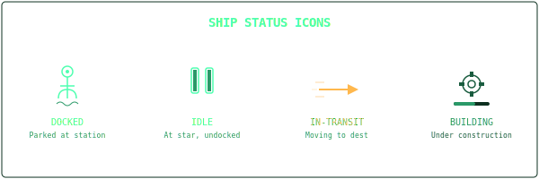
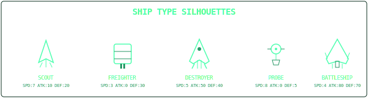
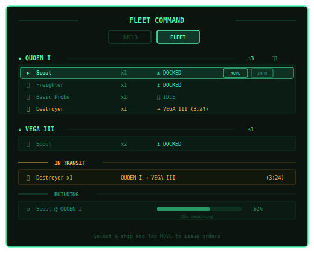
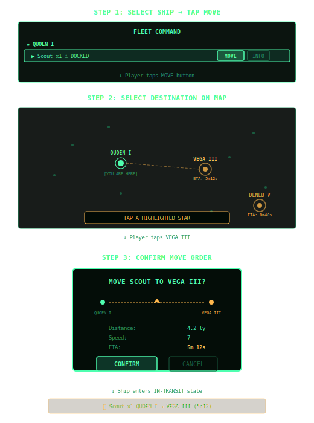
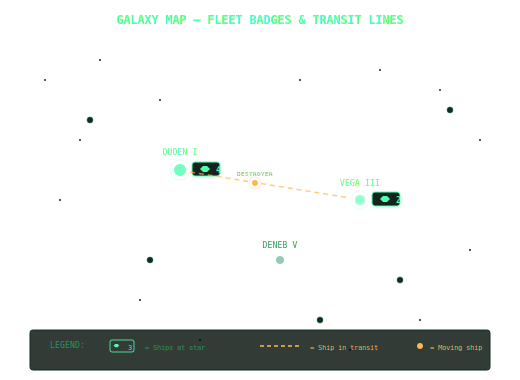
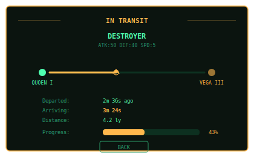
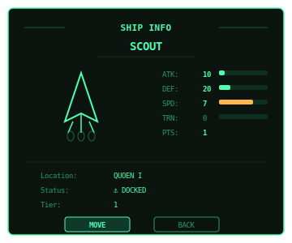

# Fleet Management UI — Mock Renderings

## Design Metaphor: Fleet Command (CIC)

Naval command center aesthetic. Green-on-black terminal look matching existing dock panel.
Player is an admiral issuing orders from their station.

---

## Ship Status Icons

| Status    | Icon | Color        | Description                    |
|-----------|------|--------------|--------------------------------|
| DOCKED    | ⚓   | Bright green | Parked at a station            |
| IDLE      | ⏸    | Medium green | At star, not docked            |
| IN-TRANSIT| →    | Yellow/amber | Moving between stars           |
| BUILDING  | ⚙    | Dim green    | Under construction             |

---

## Ship Type Silhouettes

---

## Fleet Command Panel

Accessed via SHIPS button → tabs between BUILD and FLEET.

---

## Move Order Flow (3 Steps)

---

## Galaxy Map — Fleet Badges & Transit Lines

---

## In-Transit Detail View

---

## Ship Info Panel

---

## Color Palette

| Token    | Hex       | Usage                          |
|----------|-----------|--------------------------------|
| G_BRIGHT | `#4fffb0` | Active/enabled text & borders  |
| G_MED    | `#2a9968` | Secondary text, labels         |
| G_DIM    | `#1a5c3f` | Disabled, hint text            |
| G_FAINT  | `#0d3020` | Inactive borders               |
| AMBER    | `#ffb84d` | In-transit highlights          |
| RED      | `#ff4f4f` | Alerts, combat (future)        |

---

## Implementation Phases

### Phase 1 — Data Model
- Add `ShipInstance` with unique ID, location, status, destination, departedAt, arrivalAt
- Migrate from count-based (`{typeId, count}`) to instance-based tracking
- Server reconciliation for transit completion

### Phase 2 — Fleet Roster Panel
- BUILD/FLEET tab toggle on ship panel
- Roster grouped by star location
- Status indicators per ship

### Phase 3 — Move Orders
- Select ship → MOVE button → tap star → confirm
- Server records transit with departure/arrival times
- Client shows countdown

### Phase 4 — Galaxy Map Integration
- Fleet badges on stars
- Transit lines (animated dotted)
- Pulsing indicators for activity

### Phase 5 — Polish
- Ship info detail panel
- Transit progress visualization
- Arrival notifications
- Sound cues (future)

---

## Panel Sizing

| Panel            | Width        | Height      | Position           |
|------------------|--------------|-------------|-------------------|
| Fleet Command    | 480px max    | 280px       | Bottom center      |
| Move Confirm     | 240px        | 160px       | Center screen      |
| Ship Info        | 320px        | 240px       | Center screen      |
| Galaxy Badge     | 24x16px      | —           | Adjacent to star   |

---

## Open Questions

1. **Instance-based vs count-based ships?**
   - Count-based is simpler but can't track individual ship movement
   - Recommend: split into instances when moving, re-merge counts at destination
   - e.g., "Move 1 of 3 Scouts" creates 1 instance in-transit, leaves 2 at origin

2. **Can ships move while not docked?**
   - Recommendation: Yes, from fleet panel (no need to be at that star's dock)

3. **Maximum fleet size per star?**
   - Unlimited for now; could add berth limit tied to dock level later

4. **Can you send multiple ships together?**
   - V1: one at a time. V2: multi-select for fleet dispatch
