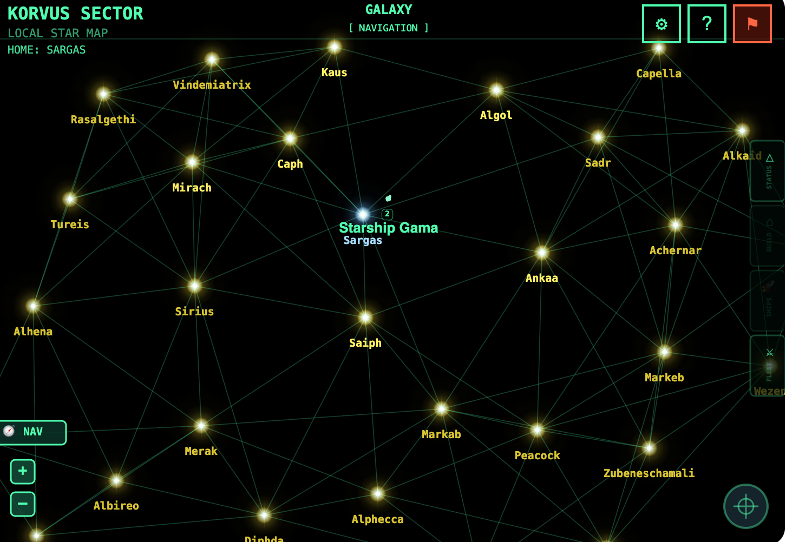
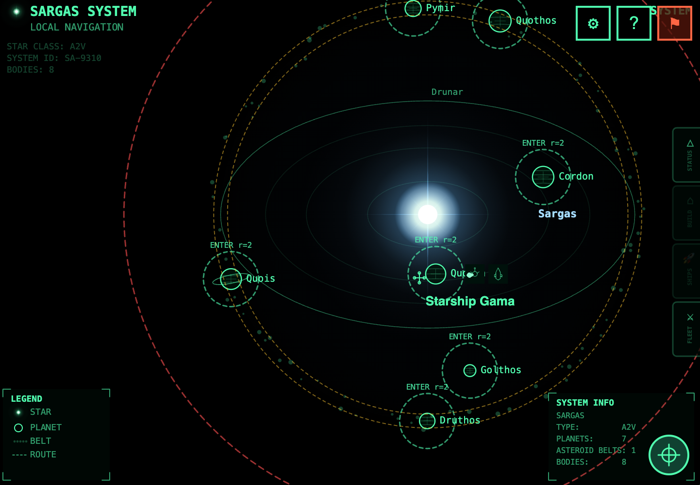
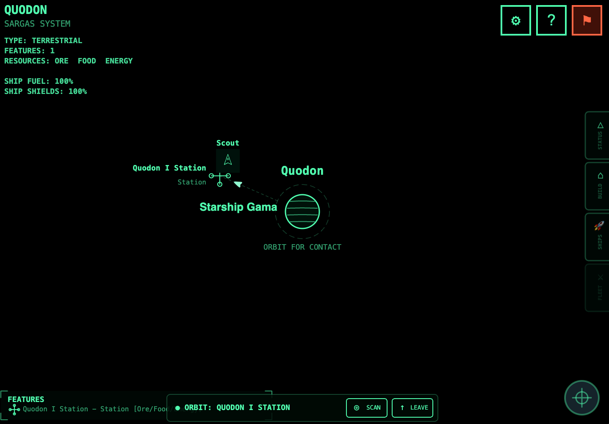

# Valcordia Space

A multiplayer space exploration and strategy game built on Reddit's [Devvit](https://developers.reddit.com/) platform. Explore a procedurally generated galaxy, build stations, manage fleets, and expand your empire — all from within a Reddit post.

## Screenshots

| Galaxy Map | Solar System | Planet View |
|:---:|:---:|:---:|
|  |  |  |

## Gameplay

Players start docked at a home star station with a Scout ship. From there:

- **Explore** — Navigate a galaxy of 100+ stars connected by jump links
- **Dock & Build** — Land at stations to construct mines, solar arrays, habitats, and warehouses
- **Upgrade** — Follow the ship upgrade path: Scout → Destroyer → Frigate → Battleship → Command Cruiser → Dreadnought
- **Probe** — Send Basic or Enhanced Probes to reveal distant star systems before visiting
- **Fleet Management** — Build and deploy ships across multiple star systems, transfer ships between stars
- **Colonize** — Send Colony Ships to unclaimed stars, dock at the station, and press COLONIZE to expand your empire
- **Discover** — Stars progress from Unexplored → Probed → Visited as you explore
- **NPC Ships** — An automated probe (VALCORDIA_PROBE) patrols the galaxy, visiting star systems and planets. It appears as a normal ghost ship with realistic arrive/linger/depart behavior.

### Navigation Tiers

The game uses a hierarchical zoom system:

| Tier | View | What You See |
|------|------|-------------|
| Galaxy | Star map | All stars, jump links, fleet indicators |
| System | Solar system | Orbital rings, planets, asteroid belts |
| Local | Asteroid belt | Asteroids, fuel pods, combat |
| Planet | Planet surface | Station, mines, features, docking |

### Economy & Resources

Each star system produces three resources:
- **Ore** — Mined from asteroids and mines
- **Food** — Produced by habitats
- **Energy** — Generated by solar arrays

Resources are used to construct buildings and ships at your stations.

### Ships

| Ship | Role | Upgrade Path |
|------|------|-------------|
| Scout | Starting ship | ✓ |
| Destroyer | Combat | ✓ |
| Frigate | Heavy combat | ✓ |
| Battleship | Capital ship | ✓ |
| Command Cruiser | Fleet command | ✓ |
| Dreadnought | Ultimate warship | ✓ |
| Basic Probe | Star discovery | — |
| Enhanced Probe | Advanced discovery | — |
| Colony Ship | Colonization | — |
| Freighter | Resource transport | — |

## Tech Stack

- **Platform**: [Reddit Devvit](https://developers.reddit.com/) (WebView custom post)
- **Renderer**: Canvas2D (hand-drawn, no DOM game UI)
- **Server**: [Hono](https://hono.dev/) running on Devvit's server runtime
- **Storage**: Redis (Devvit's built-in KV store)
- **Build**: [Vite](https://vite.dev/) + [TypeScript](https://www.typescriptlang.org/)
- **Galaxy Generation**: Poisson-disc sampling, deterministic seeded RNG

## Development

### Prerequisites

- Node.js 22+
- Reddit account with [Devvit CLI](https://developers.reddit.com/docs/get-started) set up

### Commands

```bash
npm run ship          # Bump version, upload, and install to dev subreddit
npm run dev           # Start playtest (hot reload)
npm run build         # Build client and server
npx tsc --noEmit      # Type-check without building
```

### Project Structure

```
src/
  client/         # WebView entry points (game.ts, inline.html)
  server/         # Hono API routes + game service
    core/         # Game service (economy, ships, fleet)
    routes/       # API endpoints (including bots.ts for NPC management)
  game/           # Client-side game engine
    game-loop.ts  # Main loop, state management, tier transitions
    renderer.ts   # All canvas rendering, UI panels, hit testing
    galaxy.ts     # Galaxy/system generation, navigation
    ship.ts       # Ship movement, boundary scrolling
    dock.ts       # Docking system
    camera.ts     # Camera & zoom
    input.ts      # Pointer/touch input
    shooting.ts   # Combat system
    asteroids.ts  # Asteroid generation
  shared/         # Types shared between client and server
    ships.ts      # Ship catalog, upgrade path
    api.ts        # API request/response types
assets/
  icons/          # SVG ship and building icons
```

## Current Version

v1.3.67

## Changelog (since v1.3.0 — last approved)

### v1.3.44–1.3.67 (Aug 11–12, 2026)

**Journey Telemetry (State-Based)**
- Replaced arbitrary milestone events with build-tree-depth progress calculation
- Progress now reflects actual player state: buildings, ships, stars discovered, colonized
- Journey 1 completes at star colonization (progress = 1.0)
- Server-side telemetry logs include username for playtest monitoring
- `journeyAction()` fires on every meaningful server interaction (build, buy_ship, colonize, explore, trade, transfer, raid)

**Mobile UI Overhaul**
- View mode detection: `isMobile`, `isPortrait` flags exposed to renderer
- Planet + orbit ring scale down proportionally on mobile
- HUD text (top-left info panel) uses smaller fonts on mobile, stays on-screen
- Feature labels always render to the right on mobile (no left-side overflow)
- Icon bar buttons shrink on mobile (28px vs 36px)
- Admin panel compact layout on mobile
- Recenter button repositioned above orbit bar on mobile
- Planet tier exit boundary uses actual screen aspect ratio (fixes stuck-on-mobile bug)

**Help Panel Redesign**
- 6 tabs: Next, Guide, Controls, Buildings, Ships, Tree
- "Next" tab: dynamic suggestions based on journey milestone completion
- "Guide" tab: gameplay quickstart (from USER_GUIDE.md content)
- "Tree" tab: full HTML build dependency tree with color-coded nodes
- Buildings/Ships: paginated with Prev/Next buttons (no scrolling — Reddit compliance)
- Tapping an icon shows info description below

**Performance**
- Bundle size reduced from 155MB → 34MB (removed _reference images, intermediates, backups)
- Asset preloading deferred to after splash render (non-blocking first paint)
- Loading screen: CSS-only spinner shown during JS load, hidden when game starts
- 8-second safety timeout prevents infinite loading state
- Ship icon 404s fixed (corrected path to wireframe SVGs)
- WIRE button removed from icon bar (admin-only via settings)

**Bug Fixes**
- Fixed "DOCK TO ACCESS" black rectangle artifact persisting after tier change
- Fixed Planet tier exit not working on mobile (hardcoded aspect ratio)
- Devvit upgraded to 0.14.0

**Playtest Monitoring Tools**
- `playtest-monitor.sh` — streams telemetry from devvit logs with formatted output
- `playtest-sankey.py` — generates Plotly funnel + Sankey charts from JSONL logs
- Cannon icons use scifi PNGs (wireframe SVGs don't exist for cannons)

## Reddit App Review Compliance

### 1. In-line Scroll Trap (Fixed)

**Requirement:** [Inline mode](https://developers.reddit.com/docs/capabilities/server/launch_screen_and_entry_points/view_modes_entry_points#inline-mode-requirements) web views must not trap scrolling — this interferes with Reddit-native gestures.

**What we did (v1.1.32 – v1.1.37):**

- **Removed all `overflow-y: auto`** from every HTML panel (help, admin, debug log, ghost list, player stats). No scrollable containers remain in the inline view.
- **Replaced scrollable lists with paginated tap-button navigation:**
  - Help panel → split into CONTROLS / BUILDINGS / SHIPS tabs
  - Ghost list → paginated (5 per page) with PREV / NEXT buttons
  - Admin player stats → paginated (4 per page) with PREV / NEXT buttons
- **Canvas `touch-action`** set to `manipulation` in inline mode (allows native scroll-through) and `none` in expanded mode (full gesture control).
- **Scroll wheel and pinch-zoom listeners** only attached in expanded mode — inline mode uses on-screen +/− buttons for galaxy zoom.
- **Inline entry** uses a splash attract-mode animation with two buttons: "Play Here" (starts inline gameplay) and "Play Full Size" (calls `requestExpandedMode()` to transition to expanded).

**Commits:** `c844106` (v1.1.32), `522bd4b` (v1.1.37)

### 2. Admin / Debug Endpoint Security (Fixed)

**Requirement:** Admin and debug endpoints must have server-side authentication — they cannot rely on client-supplied credentials.

**Purpose of admin endpoints:** These are strictly **developer debugging tools**, not moderator features. The game is a complex multiplayer system with server-side economy, fleet state, and building queues stored in Redis. When something goes wrong in a live game (e.g. a player's economy gets stuck, a star claim is corrupted, or build queues stall), the dev team needs the ability to inspect and reset state without redeploying the app. These endpoints are not intended for subreddit moderators — moderators use Reddit's native mod tools and modmail (see UGC Reportability below). The admin panel is hidden from all non-dev users in the client UI.

**Admin endpoints and what they do:**

| Endpoint | Purpose |
|---|---|
| `GET /debug/profile-raw` | Inspect a player's raw Redis hash to diagnose data issues |
| `POST /stars/reset` | Re-roll star claims when generation is bugged |
| `POST /admin/reset-all` | Full game reset for a post (used when testing major updates) |
| `POST /debug/complete-builds` | Instantly finish build queues (used to test late-game content) |
| `POST /debug/spawn-enemy` | Create a test opponent for combat testing |
| `POST /debug/reset-fleet` | Clear a player's fleet to recover from fleet state corruption |
| `GET /admin/player-stats` | View all player summaries to diagnose balance issues |
| `POST /api/bots/autobot/tick` | Force an NPC bot FSM tick (advance state) |
| `GET /api/bots/autobot/state` | View current bot FSM state and location |
| `POST /api/bots/autobot/reset` | Reset bot to initial dormant state |
| `POST /api/bots/autobot/flyby` | Inject bot pose at player's current location for testing |

**How authentication works:**

- Created `requireDev` middleware (`src/server/core/admin-auth.ts`) that calls `reddit.getCurrentUsername()` — this is the **Devvit-authenticated Reddit identity**, resolved server-side from Reddit's own auth layer. It cannot be spoofed or forged from the client.
- The middleware checks the authenticated username against a hardcoded developer list: `DEV_USERS = ['WeirdAd4511']`. If the caller is not on this list, the request is rejected with HTTP 403.
- Applied to all admin/debug endpoints in `api.ts` and globally to all bot management routes via `bots.use('*', requireDev)`.
- Removed a prior `body.admin` boolean that the client could set to bypass charge limits on `/debug/complete-builds` — this client-trusted flag no longer exists.
- The client-side `ADMIN_USERS` list is retained only for **UI visibility** (shows/hides the admin panel in the settings screen). It has zero security impact — even if a user modified the client to show the panel, every API call would be rejected server-side by `requireDev`.

### 3. UGC Reportability (Fixed)

**Requirement:** All user-generated content must be reportable so moderators can act on policy violations.

**What we did:**

- Added a **⚑ report button** on every peer DM message in the conversation view (canvas-rendered, per-message hit target).
- Created `POST /api/coms/dm/report` server endpoint that:
  1. Validates and deduplicates reports via a `reports:{postId}` Redis sorted set
  2. Sends a formatted report to **subreddit modmail** via `reddit.modMail.createConversation()` with the message content, reported user, reporter identity, and post context
  3. Author is hidden (`isAuthorHidden: true`) so the reporter's identity is only visible to moderators
- Reports flow through Reddit's own moderation infrastructure — moderators see them in their existing modmail workflow.

## License

See [LICENSE](LICENSE) file.
